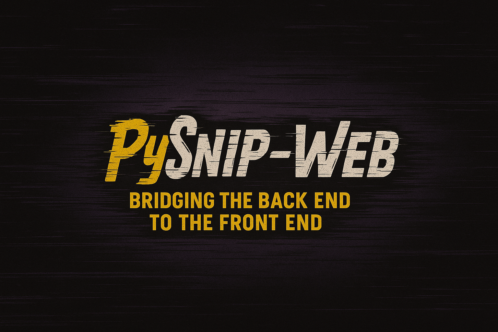

# PySnip-Web: The Visual Gateway to PySnip Tools

<p align="center">
  
  <br>
  <em>"Snippets With Teeth 🦈"</em>
</p>

<p align="center">
  <a href="https://www.python.org/downloads/"></a>
  <a href="LICENSE"></a>
  <a href="https://www.eclipse.org/legal/epl-2.0/"></a>
</p>

## What is PySnip-Web?

PySnip-Web is a dedicated web interface designed to seamlessly bridge the powerful PySnip Tools backend with an intuitive frontend experience. This repository contains a comprehensive Flask application that allows you to browse, execute, and interact with the extensive collection of PySnip utilities through your browser.

**Note:** This is an auxiliary repository that complements the main PySnip Tools collection. While PySnip Tools provides the core Python utilities, PySnip-Web delivers a visual and interactive way to leverage those tools without command-line knowledge.

## Key Features

- **Elegant Dashboard** for browsing the complete PySnip Tools collection
- **Interactive Execution Interface** with parameter configuration
- **Real-time Output Display** for immediate results
- **Tool Documentation Viewer** with integrated syntax highlighting
- **Source Code Explorer** for learning and customization
- **Mobile-Responsive Design** for on-the-go access
- **Category-based Navigation** for intuitive discovery
- **Search Functionality** to quickly find specific tools

## System Architecture

PySnip-Web functions as the bridge layer between:

1. **Backend:** The core PySnip Tools collection (Python scripts)
2. **Frontend:** A responsive web interface for tool discovery and execution

The Flask application scans your PySnip directory structure, builds a catalog of available tools, and provides an execution environment that captures parameters, runs the tools, and displays results.

## For Beginners: Getting Started

If you're new to PySnip or just want to use the tools without diving into technical details, this section is for you.

### Easy Installation

```bash
# Clone this repository
git clone https://github.com/dendogg/pysnip-web.git

# Navigate to the project directory
cd pysnip-web

# Run the setup script which handles everything for you
bash setup.sh
```

### Simple Usage

1. **Start the interface** by running `bash start_pysnip_explorer.sh`
2. **Open your browser** and go to http://localhost:5000
3. **Browse categories** to find the tool you need
4. **Click on a tool** to view its description and options
5. **Fill in parameters** if needed and click "Execute"
6. **View the results** displayed directly in your browser

### Common Use Cases

- **File Management:** Use tools to organize, rename, or clean up your files
- **Data Processing:** Convert formats, analyze data, or generate reports
- **Creative Projects:** Generate ASCII art, poems, or random content
- **Security:** Create secure passwords or encrypt sensitive files
- **System Monitoring:** Check performance metrics for your device

## For Advanced Users: Building Custom Bridges

Flask is just one way to create a bridge between PySnip Tools and a user interface. Advanced users might want to build custom integration solutions to fit their specific needs or tech stack.

### Alternative Integration Approaches

PySnip Tools can be integrated with various platforms:

1. **Web Frameworks:** Django, FastAPI, Express.js, etc.
2. **Desktop Applications:** PyQt, Tkinter, Electron
3. **Mobile Apps:** React Native, Flutter interfaces
4. **REST API Services:** Cloud Functions, AWS Lambda
5. **CLI Wrappers:** Custom shell scripts, Click-based CLI

### Creating Your Own Bridge: Basic Architecture

At its core, any integration needs to address these components:

```
[PySnip Tools] ↔ [Tool Discovery] ↔ [Parameter Collection] ↔ [Execution] ↔ [Result Display]
```

### Step-by-Step Guide to Building a Custom Bridge

1. **Tool Discovery:** 
   ```python
   def scan_pysnip_directory(root_path):
       """Implementation similar to utils/scanner.py but customized for your needs"""
       # Scan directories, identify tool structure
       # Parse metadata and docstrings
       # Build catalog of available tools
       return catalog_data
   ```

2. **Parameter Extraction:**
   ```python
   def extract_parameters(tool_path):
       """Parse docstrings and source code to identify parameters"""
       # Identify argparse patterns in source
       # Extract help text, parameter types, and defaults
       # Create a metadata structure for UI rendering
       return parameter_list
   ```

3. **Execution Engine:**
   ```python
   def execute_tool(tool_path, parameters):
       """Execute a PySnip tool with provided parameters"""
       # Build command line arguments from parameters
       # Set up process isolation if needed
       # Handle timeout and resource limits
       # Capture and format output
       return execution_results
   ```

4. **Integration Interface:**
   Choose your preferred technology and create the appropriate connectors. For example, a REST API might look like:
   ```python
   @app.route('/api/tools', methods=['GET'])
   def get_tools():
       return jsonify(scan_pysnip_directory(PYSNIP_ROOT))
       
   @app.route('/api/execute', methods=['POST'])
   def run_tool():
       data = request.json
       return jsonify(execute_tool(data['tool_path'], data['parameters']))
   ```

### Performance Optimization Tips

1. **Caching:** Implement catalog caching to avoid rescanning the directory on every request
2. **Asynchronous Execution:** Use async/await patterns for long-running tools
3. **Process Pooling:** Maintain a process pool for faster tool startup
4. **Result Streaming:** Stream execution results for real-time feedback
5. **Stateless Design:** Design your bridge to be horizontally scalable

### Security Considerations for Custom Bridges

1. **Input Validation:** Thoroughly validate all parameters before execution
2. **Resource Limits:** Implement CPU/memory/time limits on tool execution
3. **Sandboxing:** Consider containerizing tool execution (Docker, etc.)
4. **Authentication:** Add proper authentication for multi-user deployments
5. **Logging:** Implement comprehensive logging for auditing purposes

## Standard Installation and Configuration

### Prerequisites

- Python 3.8 or higher
- pip (Python package installer)
- The main PySnip Tools repository (must be installed separately)

### Installation

```bash
# Clone this repository
git clone https://github.com/dendogg/pysnip-web.git

# Navigate to the project directory
cd pysnip-web

# Install dependencies
pip install -r requirements.txt

# Configure the path to your PySnip Tools directory
# Edit config.py and update the PYSNIP_ROOT value
```

### Starting the Web Interface

```bash
# Option 1: Use the startup script
bash start_pysnip_explorer.sh

# Option 2: Start manually
python app.py
```

Then open your browser and go to http://localhost:5000

## Configuration

Edit the `config.py` file to customize your PySnip-Web experience:

```python
# Path to your PySnip Tools collection
PYSNIP_ROOT = "/path/to/your/pysnip"

# Web server settings
HOST = "0.0.0.0"  # Accessible from other devices on network
PORT = 5000       # Web server port

# Security settings (customize for production)
SECRET_KEY = "your-secret-key-here"
```

## Mobile Development Support

PySnip-Web is fully compatible with the Samsung Galaxy Z-Fold6 mobile development environment using Termux with proot-distro Ubuntu, matching the development environment of the main PySnip Tools collection.

## Project Structure

```
pysnip-web/
├── app.py                # Main Flask application
├── config.py             # Configuration settings
├── static/               # Static assets
│   ├── css/              # Stylesheets
│   ├── js/               # JavaScript files
│   └── images/           # Icons and images
├── templates/            # HTML templates
└── utils/                # Utility modules
    ├── scanner.py        # PySnip directory scanner
    ├── executor.py       # Tool execution handler
    └── doc_parser.py     # Documentation extractor
```

## License

This project is licensed under the Eclipse Public License v2.0 - see the [LICENSE](LICENSE) file for details or visit [Eclipse Public License 2.0](https://www.eclipse.org/legal/epl-2.0/).

## Relationship with PySnip Tools

PySnip-Web is designed to complement the core PySnip Tools collection by providing:

1. **Visual Discovery:** Easily browse and find tools across all categories
2. **Simplified Execution:** Run tools without command-line knowledge
3. **Learning Platform:** Explore tool documentation and source code
4. **Integration Bridge:** Connect PySnip utilities with other web services

While PySnip Tools provides the powerful backend utilities, PySnip-Web makes them accessible to users of all technical levels.

## Acknowledgements

- Created by Dennis 'dendogg' Smaltz
- Built with Flask, Bootstrap, and modern web technologies
- Designed to enhance the PySnip ecosystem

---

<p align="center"><em>"Excellence isn't optional—it's encoded."</em></p>

<p align="center">︻デ═—··· 🎯</p>

---
